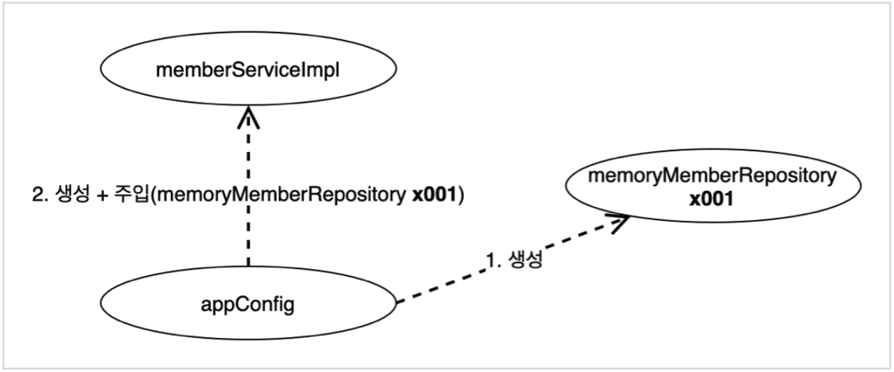

# 스프링 핵심 원리 - 기본편
## 스프링 핵심 원리 이해 - 예제 만들기
### 비즈니스 요구사항
- 회원
  - 회원을 가입하고 조회할 수 있다.
  - 회원은 일반과 VIP 두 가지 등급이 있다.
  - 회원 데이터는 자체 DB를 구축할 수 있고, 외부 시스템과 연동할 수 있다.
- 주문과 할인 정책
  - 회원은 상품을 주문할 수 있다.
  - 회원 등급에 따라 할인 정책을 적용할 수 있다.
  - 할인 정책은 모든 VIP는 1,000원을 할인해주는 고정 금액 할인을 적용한다.
  - 할인 정책은 변경 가능성이 높다.
### 회원 도메인 설계
```java
public class MemberServiceImpl implements MemberService {
    
    private final MemberRepository memberRepository = new MemoryMemberRepository();
    
    @Override
    public void join(Member member) {
        // ...
    }
}
```
- Service 코드가 `MemberRepository`의 인터페이스와 구현체 모두에 의존관계를 갖는다. &rarr; OCP, DIP 준수 X
### 주문과 할인 도메인 설계
```java
public class OrderServiceImpl implements OrderService {

    private final MemberRepository memberRepository = new MemoryMemberRepository();
    private final DiscountPolicy discountPolicy = new FixDiscountPolicy();

    @Override
    public Order createOrder(Long memberId, String itemName, int itemPrice) {
        // ...
    }
}
```
- Service 코드가 `MemberRepository`와 `DiscountPolicy`의 인터페이스와 구현체 모두에 의존관계를 갖는다. &rarr; OCP, DIP 준수 X

## 스프링 핵심 원리 이해 - 객체 지향 원리 적용
### 관심사의 분리
<br>
- 객체를 생성하고 연결하는 책임을 가진 별도의 설정 클래스(`AppConfig`)를 만들어 객체를 생성하고 연결하는 역할과 실행하는 역할을 분리한다.
- `AppConfig`는 생성한 객체 인스턴스의 레퍼런스를 생성자를 통해 주입한다.
- 클라이언트 입장에서 보면 의존관계를 외부에서 주입해주는 것과 같다. &rarr; Dependency Injection
### SOLID 원칙 적용
- SRP: 구현체를 생성하고 연결하는 책임은 `AppConfig`가 담당하고, 실행하는 책임은 클라이언트가 담당하도록 변경
- DIP: 클라이언트 코드가 추상화 인터페이스에만 의존하도록 변경
- OCP: 소프트웨어 요소를 새롭게 확장해도 사용 영역(클라이언트)의 변경은 닫혀 있도록 변경
### IoC, DI, 그리고 컨테이너
- IoC(Inversion of Control): 프로그램의 제어 흐름을 직접 제어하는 것이 아니라 외부에서 관리하는 것
  - 프로그램의 제어 흐름에 대한 권한을 모두 `AppConfig`가 가지고 있기 때문에 `MemberServiceImpl`, `OrderServiceImpl`은 필요한 인터페이스들을 호출하지만 어떤 구현체들이 실행될지는 모른다.
- DI(Dependency Injection)
  - 정적인 클래스 의존관계: 클래스가 사용하는 import 코드만 보고 의존관계를 판단할 수 있는, 즉, 애플리케이션을 실행하지 않아도 분석할 수 있는 의존관계
  - 동적인 객체(인스턴스) 의존관계: 애플리케이션 실행 시점에 실제 생성된 객체 인스턴스의 레퍼런스가 연결된 의존관계
  - 의존관계 주입을 사용하면 정적인 클래스 의존관계를 변경하지 않고, 동적인 객체(인스턴스) 의존관계를 쉽게 변경할 수 있다.
- `AppConfig`처럼 객체를 생성하고 관리하면서 의존관계를 연결해 주는 것을 IoC 컨테이너 또는 DI 컨테이너라고 한다.
### 스프링으로 전환하기
- `ApplicationContext`를 스프링 컨테이너라고 한다.
- 스프링 컨테이너는 `@Configuration`이 붙은 `AppConfig`를 설정(구성) 정보로 사용한다. 이때 `@Bean`이 붙은 메서드를 모두 호출해서 반환된 객체를 스프링 컨테이너에 등록한다. 이렇게 스프링 컨테이너에 등록된 객체를 스프링 빈이라고 한다.
- 스프링 빈은 `@Bean`이 붙은 메서드의 메서드명을 스프링 빈의 이름으로 사용한다.
- 등록된 스프링 빈은 `ApplicationContext`의 `getBean()` 메서드를 사용해서 찾을 수 있다.
- 기존에 개발자가 `AppConfig`를 사용해서 직접 객체를 생성하고 의존관계를 주입하던 것을 스프링 컨테이너에 객체를 스프링 빈으로 등록하고, 등록한 스프링 빈을 찾아서 사용하도록 변경

## 스프링 컨테이너와 스프링 빈
### 스프링 컨테이너 생성
#### 1. 스프링 컨테이너 생성
<br>
#### 2. 스프링 빈 등록
<br>
- `@Bean(name = "name")`을 사용하여 빈 이름을 직접 부여할 수도 있다.
- 이때 이미 존재하는 빈 이름을 부여할 경우 다른 빈이 무시되거나 기존 빈을 덮어버리는 등의 오류가 발생할 수 있으므로 주의해야 한다.
#### 3. 스프링 빈 의존관계 설정
<br>
### 스프링 빈 조회
- 스프링 빈은 타입 또는 빈 이름 & 타입으로 조회할 수 있다.
- 조회한 스프링 빈이 존재하지 않는 경우 `NoSuchBeanDefinitionException`이 발생한다.
- 타입으로 조회 시 같은 타입의 스프링 빈이 두 개 이상인 경우 `NoUniqueBeanDefinitionException`이 발생한다.
- 부모 타입으로 조회하면 자식 타입도 함께 조회한다.
### BeanFactory와 ApplicationContext
<br>
- BeanFactory
  - 스프링 컨테이너의 최상위 인터페이스
  - 스프링 빈을 관리하고 조회하는 역할을 담당
  - `getBean()` 메서드를 제공
- ApplicationContext
  <br>
  - `BeanFactory`에서 제공하지 않는 여러 부가기능을 제공
- `BeanFactory`를 직접 사용할 일은 거의 없다. 대부분의 경우 부가기능이 포함된 `ApplicationContext`를 사용한다.
- `BeanFactory`나 `ApplicationContext`를 스프링 컨테이너라고 한다.
### 다양한 설정 형식 지원
<br>
- 스프링 컨테이너는 자바 코드, XML, Groovy 등 다양한 형식의 설정 정보를 받아들일 수 있게 유연하게 설계되어 있다.
### 스프링 빈 설정 메타 정보
<br>
- `BeanDefinitionReader`가 다양한 형식의 설정 정보를 읽고 빈 설정 메타 정보, `BeanDefinition`을 생성한다.
- 스프링 컨테이너는 이 메타 정보를 기반으로 스프링 빈을 생성한다.

## 싱글톤 컨테이너
### 웹 애플리케이션과 싱글톤
<br>
- 웹 애플리케이션에서는 보통 여러 고객이 동시에 요청을 하는데, 스프링 없는 순수한 DI 컨테이너인 `AppConfig`는 요청을 할 때마다 객체를 새로 생성한다. &rarr; 메모리 낭비
- 해결책 &rarr; 싱글톤 패턴: 인스턴스가 딱 한 개만 생성되는 것을 보장하는 디자인 패턴
- But, 싱글톤 패턴은 유연성이 떨어짐
  - 싱글톤 패턴을 구현하기 위해 많은 코드가 필요
  - 의존 관계 상 클라이언트가 구현체에 의존 &rarr; DIP, OCP 위반
  - 테스트하기 어려움
  - 내부 속성을 변경하거나 초기화하기 어려움
  - `private` 생성자로 자식 클래스를 만들기 어려움
### 싱글톤 컨테이너
<br>
- 스프링 컨테이너는 싱글톤 패턴을 적용하지 않아도 객체 인스턴스를 싱글톤으로 관리한다. &rarr; 싱글톤 패턴의 문제점을 해결하면서 객체 인스턴스를 싱글톤으로 관리 가능
- cf. 싱글톤 레지스트리: 싱글톤 객체를 생성하고 관리하는 기능
- 스프링의 기본 빈 등록 방식은 싱글톤이지만, 싱글톤 방식만 지원하는 것은 아니다.
### 싱글톤 방식의 주의점
- 싱글톤 방식은 여러 클라이언트가 하나의 객체 인스턴스를 공유하므로 싱글톤 객체를 무상태(Stateless)로 설계해야 한다.
  - 특정 클라이언트에 의존적인 필드가 없도록 설계
  - 특정 클라이언트가 값을 변경할 수 있는 필드가 없도록 설계
  - 가급적 읽기만 가능하도록 설계
  - 팰드 대신 지역 변수, 파라미터, ThreadLocal 등을 사용하도록 설계
### @Configuration과 바이트코드 조작의 마법
<br>
- `AppConfig`의 자바 코드 상에서는 객체 인스턴스들이 여러 번 생성되는 것이 맞다.
- 따라서 스프링 컨테이너는 스프링 빈을 싱글톤 객체로 관리하기 위해 클래스의 바이트코드를 조작하는 라이브러리를 사용한다. &rarr; CGLIB라는 라이브러리를 사용해서 `AppConfig` 클래스를 상속받은 임의의 클래스를 만들고 해당 클래스를 스프링 빈으로 등록한다.
```java
// AppConfig@CGLIB 예상 코드
@Bean
public MemberRepository memberRepository() {
    if (MemoryMemberRepository가 이미 스프링 컨테이너에 등록되어 있으면) {
        return 스프링 컨테이너에서 찾아서 반환;
    } else {
        기존 로직을 호출해서 MemoryMemberRepository를 생성하고 스프링 컨테이너에 등록
        return 반환;
    }
}
```
- 이 모든 것은 `@Configuration`을 붙인 경우에만 적용된다. `@Bean`만 사용할 경우 스프링 빈으로 등록은 되지만 싱글톤 객체로 관리되지는 않는다. 
